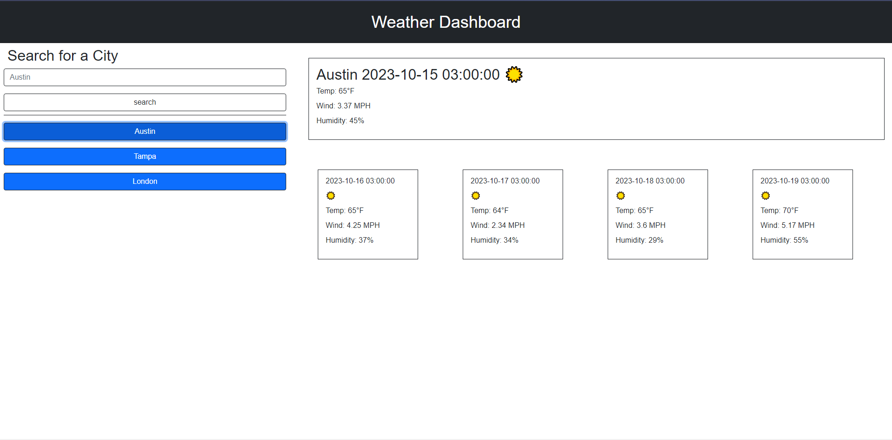

# Weather-Report

Webpage based around the use of online apis

# Description

I created a webpage that connects to the OpenWeatherMap API and applies the information onto cards. With this webpage i was able to properly connect APIs and use them in variables to both fetch further data.

# Installation

Installation: https://github.com/B-R-Ls/Weather-Report

Deployed Page: https://b-r-ls.github.io/Weather-Report/

# Usage

Once a city is input the search a button is added with said city. That button once activated will create cards with info from said city displaying the data, tempature, windspeed, and humidity percentage.

# credits

Bootstrap: https://getbootstrap.com/

jQuery: https://jquery.com/

OpenWeatherMap: https://openweathermap.org/

# License

MIT License